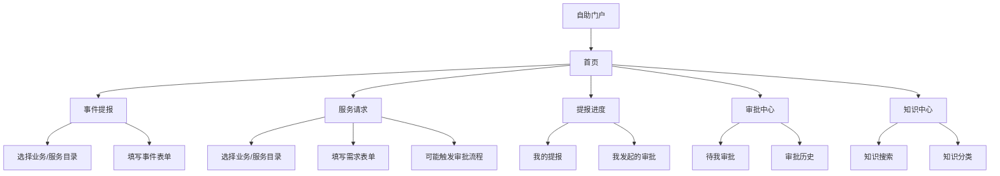
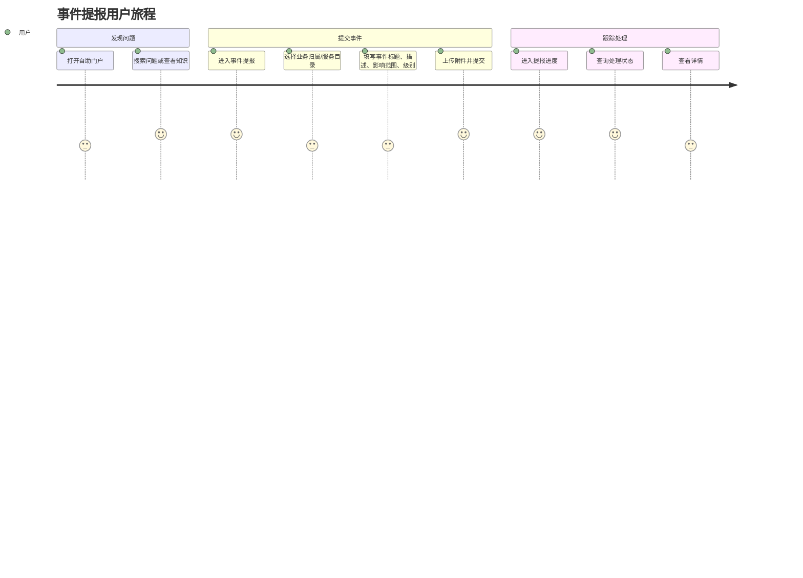
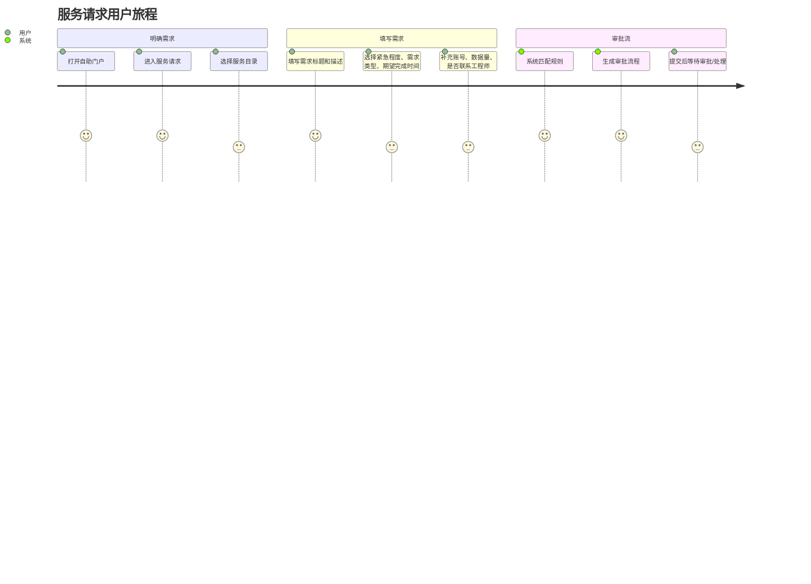
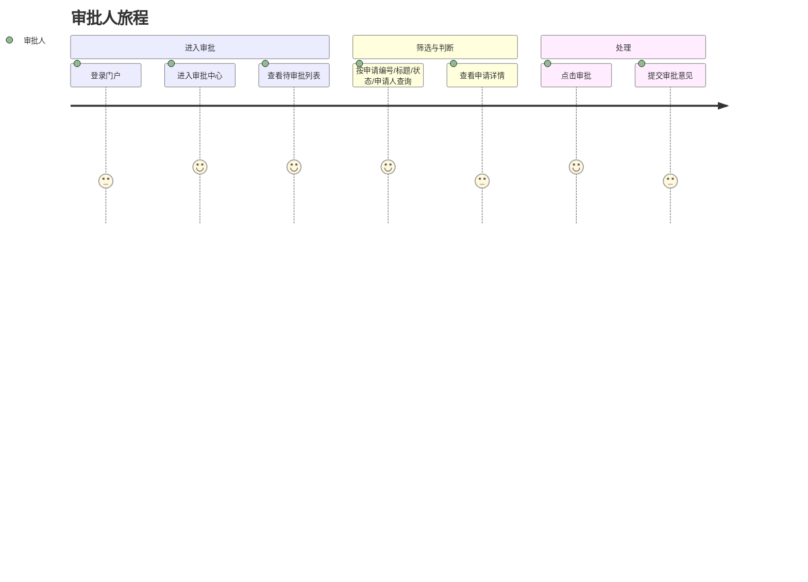

# self-help 自助门户产品视角梳理

资料来源：`selfhelp-1-selfhelp.zip` 的页面快照、页面字段、按钮、表格和网络请求记录。

适用对象：产品经理、业务分析、需求评审、流程梳理。

## 1. 产品定位

`self-help` 是一个面向内部用户/业务用户的自助服务门户，核心目标是让用户可以：

- 自助查找知识和公告，减少人工咨询。
- 按服务目录发起事件提报或服务请求。
- 查看自己提交事项的处理进度。
- 对需要审批的事项进行查看、审批。
- 通过统一入口访问不同业务域、项目、服务类型。

从快照看，这不是单一工单系统，而是一个“统一自助入口 + 服务目录 + 表单模板 + 工单/审批流 + 知识库”的组合型门户。

## 2. 目标用户与角色

| 角色 | 主要诉求 | 可见功能 |
| --- | --- | --- |
| 普通提报人 | 遇到问题或有服务需求时快速提交，并跟踪进度 | 首页、事件提报、服务请求、提报进度、知识中心 |
| 审批人 | 处理分配给自己的审批事项 | 审批中心、请求审批、审批/查看 |
| 项目/服务配置人员 | 配置服务目录、模板、流程、知识关联 | 本次快照未进入后台，但前台依赖这些配置 |
| 服务工程师/处理组 | 接收工单并处理 | 本次快照未进入处理后台，但服务请求会查询工程师组 |

当前登录用户 `weiby3` 同时具备普通门户用户和审批查看/处理入口权限。

## 3. 产品信息架构

## 4. 核心用户旅程

### 4.1 用户遇到系统故障

产品关注点：

- 事件提报适合故障、异常、缺陷类问题。
- 表单中有 P1/P2/P3/P4 事件级别定义，说明系统强调影响等级和紧急程度。
- 对 P1/P2 有额外提示：需要电话或 Teams 联系服务台/系统工程师，说明线上提报不是最高优先级事件的唯一处理通道。

### 4.2 用户提交服务请求

产品关注点：

- 服务请求偏“需求/申请/配置/数据/账号/支持”类事项。
- 系统会进行规则匹配，并生成审批流程，说明不是所有请求都直接进入处理，部分请求需要审批。
- 字段包括 User Account、数据量、已联系工程师，推测该门户覆盖数据类、权限类、应用支持类服务。

### 4.3 审批人处理申请

产品关注点：

- 审批中心支持“待审批”和“历史审批”。
- 列表字段包含当前处理人，说明审批流可能多节点、多处理人。
- 快照中只看到审批列表和按钮，未捕获审批详情/审批意见页。

## 5. 模块产品说明

### 5.1 首页

定位：统一入口和问题搜索入口。

已识别功能：

- 搜索框：`请输入您所遇到的问题`
- 查看更多
- 关联公告、知识、服务目录、收藏目录

产品价值：

- 降低用户寻找入口的成本。
- 将知识库前置，减少重复提单。
- 通过收藏服务目录提高高频提报效率。

可优化点：

- 搜索结果应同时覆盖知识、服务目录、历史提报。
- 首页可以增加“我的待办/我的提报/常用服务”聚合卡片。
- 对高频服务目录提供推荐入口。

### 5.2 事件提报

定位：提交故障、异常、线上缺陷、系统不可用等事件。

已识别字段：

| 字段 | 产品含义 |
| --- | --- |
| 业务归属 | 标识所属业务线/系统 |
| 事件标题 | 简要描述问题 |
| 事件描述 | 详细说明问题现象 |
| 提报项目 | 关联项目 |
| 影响范围 | 说明影响用户/组织/业务范围 |
| 事件类型 | 区分事件分类 |
| 事件开始时间 | 记录故障开始时间 |
| 事件级别 | P1/P2/P3/P4 |
| 附件 | 截图、日志、补充材料 |

事件级别说明：

| 级别 | 页面定义含义 |
| --- | --- |
| P1 | 系统服务瘫痪或核心主流程瘫痪，影响大范围用户无法正常使用 |
| P2 | 模块服务不可用，影响部分用户无法正常使用 |
| P3 | 部分功能点不可用或存在线上缺陷，影响少量用户使用，但不影响整体业务正常运行 |
| P4 | 系统可以持续运行，但存在一定缺陷，可能导致可预见风险 |

产品关注点：

- P1/P2 应有强提示、升级机制、电话/Teams 联络机制。
- 事件级别最好通过影响范围、用户数量、核心流程是否中断进行辅助判断，减少用户误选。
- 可加入重复事件提醒：用户输入标题或选择目录后，推荐相似已知事件/知识。

### 5.3 服务请求

定位：提交需求、账号、数据、配置、工程师支持等非故障类服务申请。

已识别字段：

| 字段 | 产品含义 |
| --- | --- |
| 单据类型 | 区分请求类型 |
| 业务归属 | 所属业务/系统 |
| 需求标题 | 请求摘要 |
| 需求描述 | 请求详情 |
| 提报项目 | 关联项目 |
| 紧急程度 | 处理优先级 |
| 期望完成时间 | 用户期望交付时间 |
| 需求类型 | 请求分类 |
| User Account | 相关账号 |
| 数据量 | 数据相关请求规模 |
| 已联系工程师 | 是否已有线下沟通 |
| 附件上传 | 补充材料 |

产品关注点：

- 服务请求存在审批流生成，需明确哪些目录/条件触发审批。
- “期望完成时间”与“紧急程度”应有校验，避免所有用户都选最高优先级。
- 如果“已联系工程师”为是，应可填写工程师姓名或聊天记录/备注。

### 5.4 提报进度

定位：用户查看自己提交事项的状态。

已识别字段：

| 字段 | 产品含义 |
| --- | --- |
| 申请单号 | 单据唯一编号 |
| 事件标题 | 单据标题 |
| 处理状态 | 当前处理阶段 |
| 申请时间 | 创建时间 |
| 操作 | 查看 |

已识别操作：

- 查询
- 重置
- 自助提报
- 查看

产品关注点：

- “提报进度”名称偏事件，但实际可能同时展示事件、服务请求、审批申请。
- 建议区分：我的事件、我的服务请求、我发起的审批。
- 列表中应展示当前处理人/当前节点/预计完成时间，帮助用户判断是否需要催办。

### 5.5 审批中心

定位：审批人处理分配给自己的审批任务。

已识别字段：

| 字段 | 产品含义 |
| --- | --- |
| 申请编号 | 审批单号 |
| 申请标题 | 审批事项标题 |
| 申请状态 | 审批中/完成/驳回等 |
| 当前处理人 | 当前审批节点负责人 |
| 申请人 | 发起人 |
| 开单时间 | 创建时间 |
| 操作 | 审批/查看 |

产品关注点：

- 当前列表有“审批”和“查看”，但未看到批量审批。
- 审批人需要快速判断影响：标题、申请人、业务归属、紧急程度、期望完成时间应尽量可见。
- 审批详情页应展示原始请求表单、审批流节点、历史意见、附件。

### 5.6 知识中心

定位：知识检索与自助解决。

已识别字段：

| 字段 | 产品含义 |
| --- | --- |
| 查询关键词 | 搜索知识 |
| 分类 | 按知识分类筛选 |
| 文章标题 | 知识标题 |
| 更新时间 | 知识新鲜度 |

已见文章：

- 自助门户操作手册，更新时间：2026-06-02 13:48:34

产品关注点：

- 知识中心应与服务目录强关联：用户选目录时，推荐相关知识。
- 知识详情页应支持收藏、反馈是否有用、关联提单。
- 对搜索无结果场景，应引导用户发起事件或服务请求。

## 6. 服务目录产品结构

本次快照中服务目录覆盖范围很广，主要包括：

| 目录族 | 示例 |
| --- | --- |
| IPS | ISG、IDG、KT、JV、IDV、AISR |
| PMS | 采购 |
| SSCM | ISG、IDG |
| SF-设备工单（SaaS） | IDG、ISG、客户项目、ASM管理 |
| SF-运维服务（SaaS） | 擎天AI应用运维、MS项目、T3服务、测试_请勿提单 |
| SF-智能运营（SaaS） | 运营大屏、元数据管理、运营看板、数据集成、ETL、运营报表、AISR |
| SF-公共服务（SaaS） | ISG、IDG、客户项目 |
| SF-升级管理（SaaS） | 技术升级、事务性升级 |
| SF-备件库存（SaaS） | ISG、IDG、客户项目 |
| SF商业交付（SaaS） | 中足联项目、机器人 |
| CoData 报表服务 | 魔方报表、CEC、CES、CRS、VMI、成本标准化、DAAS、LifeCycle 等 |
| 其他 | SF-ITSM本地版、智能语音IVR、销服一体、自动化测试平台、联想魔方 |

产品含义：

- 该门户不是某一个系统的服务台，而是跨多个业务系统/项目的统一提报入口。
- 服务目录是核心配置资产，决定用户进入哪个表单、哪个流程、哪个审批规则、关联哪些知识。
- 目录层级可能至少两级：一级服务族，二级业务归属/项目。

## 7. 状态与流程推断

### 7.1 提报单状态

从页面字段可见：

- 处理状态
- 申请状态
- 审批中

建议产品定义完整状态：

| 状态 | 含义 |
| --- | --- |
| 草稿 | 用户填写中，未提交 |
| 已提交 | 已生成单据 |
| 审批中 | 需要审批，等待当前处理人 |
| 已驳回 | 审批未通过 |
| 待受理 | 审批通过或无需审批，等待服务团队接单 |
| 处理中 | 工程师/服务团队处理中 |
| 待用户确认 | 处理完成，等待用户确认 |
| 已完成 | 流程结束 |
| 已取消 | 用户或系统取消 |

### 7.2 审批单状态

建议产品定义：

| 状态 | 含义 |
| --- | --- |
| 审批中 | 至少一个审批节点未完成 |
| 已通过 | 所有审批节点通过 |
| 已驳回 | 任一关键节点驳回 |
| 已撤回 | 发起人撤回 |
| 已转交 | 当前节点处理人变化 |

## 8. 产品需求补充清单

如果要继续完善 PRD，建议补齐以下信息：

| 优先级 | 需要补充 | 原因 |
| --- | --- | --- |
| P0 | 事件提报提交后的状态流转 | 决定工单主流程 |
| P0 | 服务请求提交后的状态流转 | 决定请求闭环 |
| P0 | 审批动作页和审批结果 | 决定审批中心核心体验 |
| P0 | 详情页字段 | 决定查看、追踪、催办、复盘能力 |
| P1 | 服务目录配置规则 | 决定表单、流程、审批、知识如何联动 |
| P1 | 不同目录触发审批的条件 | 决定用户预期和审批负载 |
| P1 | 通知机制 | 用户是否通过邮件/IM/站内信获知进度 |
| P1 | SLA/超时规则 | 决定处理优先级和升级机制 |
| P2 | 收藏、搜索、推荐规则 | 决定自助效率 |
| P2 | 知识反馈与沉淀机制 | 决定知识库质量 |

## 9. 产品风险与改进建议

### 9.1 入口和命名可能混淆

观察：

- “事件提报”“服务请求”“提报进度”“审批中心”是分散入口。
- “提报进度”列表里似乎同时出现申请编号/申请标题，容易和审批申请混淆。

建议：

- 将“我的事项”作为统一入口，内部区分：我的事件、我的服务请求、我的审批申请。
- 列表明确单据类型，避免用户不知道自己查到的是工单还是审批单。

### 9.2 服务目录过多，用户选择成本高

观察：

- 服务目录覆盖大量业务线和系统。
- 当前目录页有过滤输入框，但目录名称较长。

建议：

- 增加最近使用、我的收藏、热门目录。
- 搜索支持别名、系统名、业务名、拼音/缩写。
- 用户选择目录后展示“你将提交给哪个团队/预计处理时长/是否需要审批”。

### 9.3 P1/P2 事件需要更强的应急体验

观察：

- 页面文案提醒 P1/P2 要电话或 Teams 联系服务台/工程师。

建议：

- 当用户选择 P1/P2 时，弹出应急提示。
- 显示服务台联系方式或 Teams 联系入口。
- 提交后自动高亮进入升级队列，并通知相关值班人员。

### 9.4 审批透明度需要加强

观察：

- 审批列表有当前处理人，但快照中未看到审批流详情。

建议：

- 审批详情页展示流程节点、当前节点、历史审批意见。
- 对发起人展示“当前卡在哪个节点”。
- 支持催办、撤回、补充材料。

### 9.5 知识库可以更主动

观察：

- 知识中心存在，但事件/服务请求表单中应进一步联动。

建议：

- 用户选择服务目录后自动推荐相关知识。
- 用户输入标题/描述时实时推荐相似知识和历史问题。
- 提交前提示“是否已有解决方案”，减少重复提单。

## 10. 可直接用于 PRD 的功能清单

| 模块 | 功能点 | 当前证据 | PRD 状态 |
| --- | --- | --- | --- |
| 登录 | ADFS 登录、MFA、回跳 | 已捕获 | 可描述 |
| 首页 | 搜索、公告、知识、服务目录、收藏 | 已捕获接口 | 可描述 |
| 事件提报 | 目录选择、事件表单、附件 | 已捕获页面 | 缺提交结果 |
| 服务请求 | 目录选择、请求表单、附件 | 已捕获页面 | 缺最终提交 |
| 服务请求 | 规则匹配、审批流生成 | 已捕获接口 | 可描述 |
| 提报进度 | 查询、重置、查看、自助提报 | 已捕获页面 | 缺详情 |
| 审批中心 | 待审批、历史、审批、查看 | 已捕获页面/接口 | 缺审批动作 |
| 知识中心 | 分类、搜索、文章列表、收藏 | 已捕获页面 | 缺详情 |

