# self-help 自助门户系统关系还原

资料来源：`/Users/weiby3/Downloads/selfhelp-1-selfhelp.zip` 中导出的 17 个页面快照、页面元信息和网络请求记录。

导出时间：2026-06-03 11:52 左右。

## 1. 系统边界

本次快照还原出的系统是联想 `self-help` 自助门户，主入口为：

- 前端站点：`https://self-help.sf.lenovo.com`
- 认证入口：`https://stscn.lenovo.com/adfs/ls/`
- 项目编码：`JJFACPYW`
- 当前可见角色：普通门户用户，同时可进入“请求审批”列表

从页面和接口看，系统由以下几类能力组成：

| 层级 | 名称 | 作用 |
| --- | --- | --- |
| 认证层 | ADFS / SAML 登录 | 登录、MFA、回跳门户 |
| 门户配置层 | `orgauthorityapi` | 登录项目、验证码、参数字典、工程师组等基础数据 |
| 自助门户层 | `selfserviceapi/selfportal` | 门户配置、客户信息、主字段、收藏服务目录 |
| 工单/服务目录层 | `selfserviceapi/selforder` | 服务目录、事件/服务请求模板、知识库、公告、提报记录 |
| 审批层 | `selfserviceapi/approvalOrder` | 审批流生成、审批表单、待审批/已审批/我发起列表 |

## 2. 页面关系

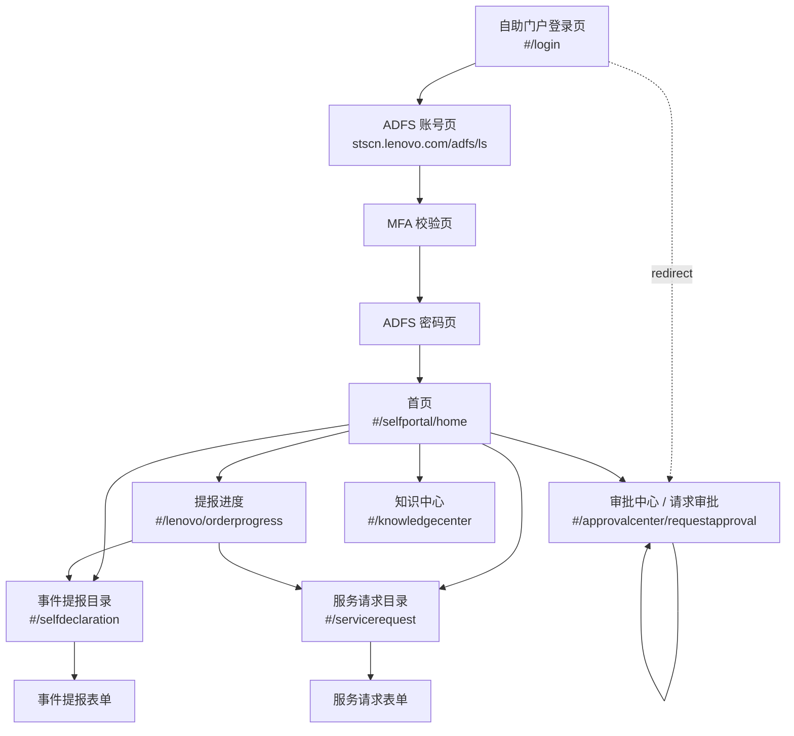

说明：

- 第 1 页从 `#/login?redirect=/approvalcenter/requestapproval` 开始，说明用户最初访问的是“请求审批”，未登录时被拦截到登录。
- 第 2 到第 5 页是 ADFS / MFA / 密码认证过程。
- 第 6 页已经进入 `#/approvalcenter/requestapproval`，说明认证成功后按 redirect 回到了审批中心。
- 第 7、10、13 页都是首页快照，期间分别进入了事件提报、服务请求、提报进度等页面。
- 第 8、9 页是事件提报目录与表单。
- 第 11、12 页是服务请求目录与表单。
- 第 14、15 页是提报进度列表，其中可触发“自助提报”和“查看”。
- 第 16 页是审批中心列表，出现“审批”和“查看”操作。
- 第 17 页是知识中心列表。

## 3. 核心业务对象关系

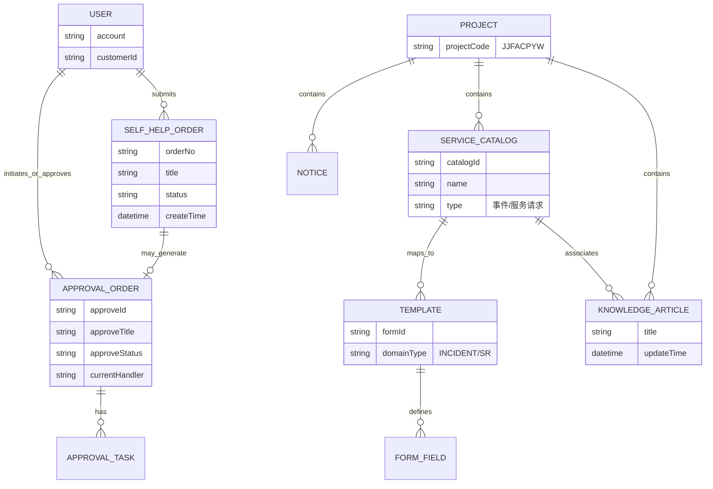

## 4. 模块还原

### 4.1 登录与认证

页面：

- `#/login?redirect=/approvalcenter/requestapproval`
- `stscn.lenovo.com/adfs/ls/`
- MFA Adapter
- ADFS 密码页

相关接口：

| 方法 | 接口 | 作用推断 |
| --- | --- | --- |
| GET | `/orgauthorityapi/login/ProjectWorkWechatApp/byDomain` | 查询当前域名下工作微信/项目登录配置 |
| GET | `/orgauthorityapi/login/adfs/saml` | 发起 ADFS SAML 登录，并携带 redirect |
| GET | `/orgauthorityapi/login/captcha` | 获取验证码 |
| GET | `/orgauthorityapi/login/project/byDomain` | 查询当前域名绑定项目 |
| GET | `/selfserviceapi/login/portal/pc?projectCode=JJFACPYW` | PC 门户登录态/项目信息初始化 |

关系：

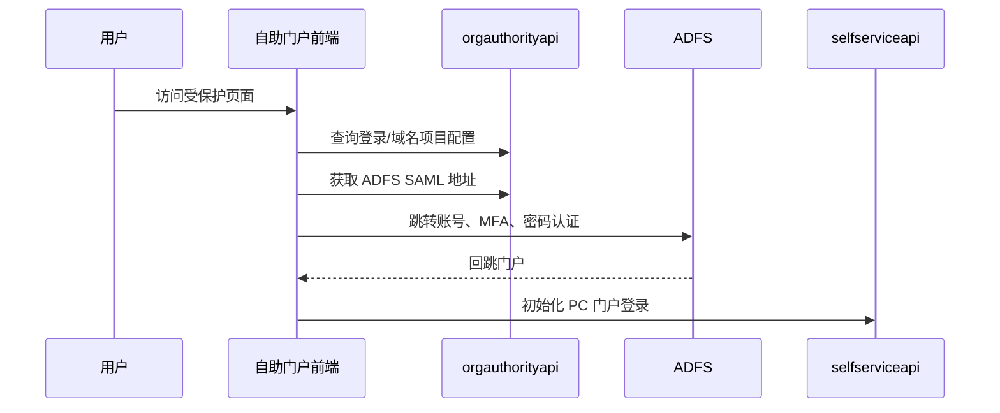

### 4.2 首页

页面：`#/selfportal/home`

可见能力：

- 搜索框：`请输入您所遇到的问题`
- 查看更多
- 公告/知识/目录入口由接口加载

相关接口：

| 方法 | 接口 | 作用推断 |
| --- | --- | --- |
| GET | `/selfserviceapi/selfportal/api/customer/JJFACPYW` | 当前客户/用户在项目下的信息 |
| GET | `/selfserviceapi/selfportal/config/detail` | 门户配置详情 |
| GET | `/selfserviceapi/selfportal/api/queryPrimaryFiledByProjectCode` | 项目主字段配置 |
| GET | `/selfserviceapi/selforder/messagecenter/notice/getNoticeList` | 公告列表 |
| GET | `/selfserviceapi/selforder/kb/searchArticleContent` | 首页知识文章列表/搜索 |
| GET | `/selfserviceapi/selforder/hierarchicalList/allList` | 服务目录树 |
| GET | `/selfserviceapi/selfportal/api/serviceCatalog/favoriteList` | 收藏的服务目录 |
| GET | `/selfserviceapi/selforder/catalogTemplateConfig/count` | 可用模板数量 |

### 4.3 事件提报

页面：

- 目录选择：`#/selfdeclaration`
- 表单填写：同路由内的事件表单

可见字段：

- 业务归属
- 事件标题
- 事件描述
- 提报项目
- 影响范围
- 事件类型
- 事件开始时间
- 事件级别
- 附件

相关接口：

| 方法 | 接口 | 作用推断 |
| --- | --- | --- |
| GET | `/selfserviceapi/selforder/hierarchicalList/allList?type=0` | 获取事件/服务目录树 |
| GET | `/selfserviceapi/selforder/templateFlowConfig/findTemplateConfiginByCatalog` | 按目录查模板流程配置 |
| GET | `/selfserviceapi/selforder/templateFlowConfig/findTemplateinByCatalog` | 按目录查模板 |
| GET | `/selfserviceapi/selforder/templateFlowConfig/findTemplateinInfo?domainType=INCIDENT` | 获取事件模板信息 |
| GET | `/selfserviceapi/selforder/paramValue/getParamValueChildrenListByParaCode?paraCode=priority` | 事件级别字典 |
| GET | `/selfserviceapi/selforder/paramValue/getParamValueChildrenListByParaCode?paraCode=iorgnization` | 影响范围/组织字典 |
| GET | `/selfserviceapi/selforder/serviceCatalog/associateWithKbList` | 目录关联知识 |

关系：

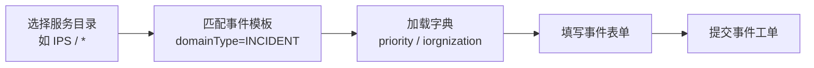

注意：快照中没有捕获到事件表单提交接口，可能用户未点击提交或提交被前端拦截。

### 4.4 服务请求

页面：

- 目录选择：`#/servicerequest`
- 表单填写：同路由内的服务请求表单

可见字段：

- 单据类型
- 业务归属
- 需求标题
- 需求描述
- 提报项目
- 紧急程度
- 期望完成时间
- 需求类型
- User Account
- 数据量
- 已联系工程师
- 附件上传

相关接口：

| 方法 | 接口 | 作用推断 |
| --- | --- | --- |
| POST | `/selfserviceapi/selforder/flowservice/rule/match` | 规则匹配，决定流程/模板/审批 |
| POST | `/selfserviceapi/approvalOrder/process/generate` | 生成审批流程 |
| GET | `/selfserviceapi/approvalOrder/config/getForm` | 获取审批表单配置 |
| GET | `/selfserviceapi/selforder/template/getTemplateInfo` | 获取具体服务请求模板 |
| GET | `/orgauthorityapi/workOrderGroupEngineer/queryByProject` | 查询项目工程师/处理组 |
| GET | `/selfserviceapi/selforder/serviceCatalog/associateWithKbList` | 目录关联知识 |
| GET | `/selfserviceapi/selforder/paramValue/getParamValueChildrenListByParaCode?paraCode=dataSize` | 数据量字典 |
| GET | `/selfserviceapi/selforder/paramValue/getParamValueChildrenListByParaCode?paraCode=reqType` | 需求类型字典 |
| GET | `/selfserviceapi/selforder/paramValue/getParamValueChildrenListByParaCode?paraCode=emergencyDegreeSR` | 紧急程度字典 |
| GET | `/selfserviceapi/approvalOrder/getValueByCatalog` | 按业务目录获取审批相关值 |

关系：

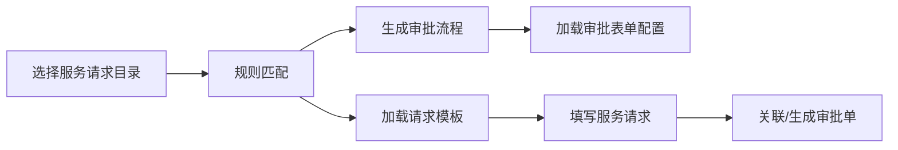

### 4.5 提报进度

页面：`#/lenovo/orderprogress`

可见字段：

- 申请单号
- 事件标题
- 处理状态
- 申请时间
- 操作：查看
- 按钮：查询、重置、自助提报

相关接口：

| 方法 | 接口 | 作用推断 |
| --- | --- | --- |
| GET | `/selfserviceapi/selforder/selfHelpIssueOrder/portalPage` | 查询当前用户门户提报记录 |
| GET | `/selfserviceapi/approvalOrder/queryMyApplyList` | 查询我发起的审批申请 |

关系：

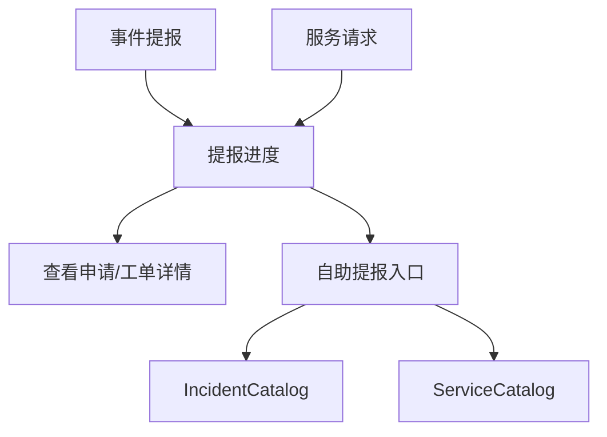

### 4.6 审批中心 / 请求审批

页面：`#/approvalcenter/requestapproval`

可见字段：

- 申请编号
- 申请标题
- 申请状态
- 当前处理人
- 申请人
- 开单时间
- 操作：审批、查看

相关接口：

| 方法 | 接口 | 作用推断 |
| --- | --- | --- |
| GET | `/orgauthorityapi/paramValue/getParamValueChildrenListByParaCode?paraCode=approveState` | 审批状态字典 |
| GET | `/selfserviceapi/approvalOrder/queryAssignList` | 查询分配给我的待审批列表 |
| GET | `/selfserviceapi/approvalOrder/queryHistoryList` | 查询我的审批历史 |
| GET | `/selfserviceapi/approvalOrder/queryMyApplyList` | 查询我发起的审批 |

关系：

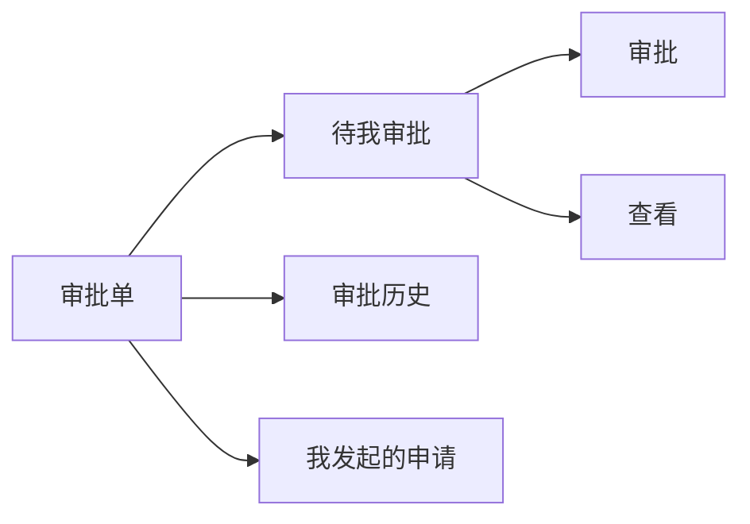

### 4.7 知识中心

页面：`#/knowledgecenter`

可见字段：

- 查询知识
- 分类选择
- 文章标题
- 更新时间
- 收藏/取消收藏

相关接口：

| 方法 | 接口 | 作用推断 |
| --- | --- | --- |
| GET | `/selfserviceapi/selforder/kb/classified` | 知识分类 |
| GET | `/selfserviceapi/selforder/kb/searchArticleContent` | 知识文章搜索 |
| GET | `/selfserviceapi/selforder/serviceCatalog/associateWithKbList` | 服务目录关联知识 |

关系：

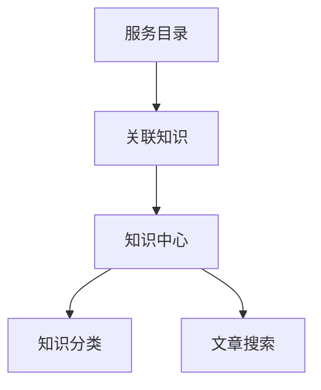

## 5. 端到端业务流程

### 5.1 登录后处理审批

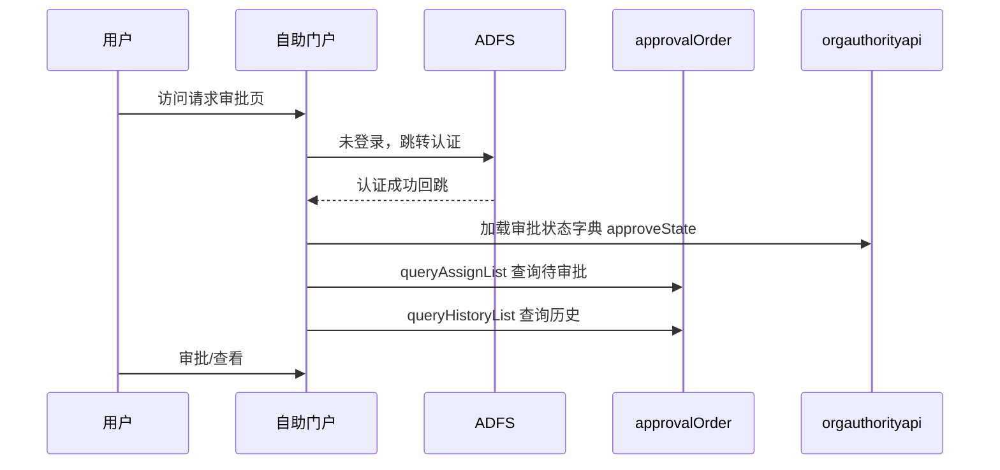

### 5.2 自助提报事件

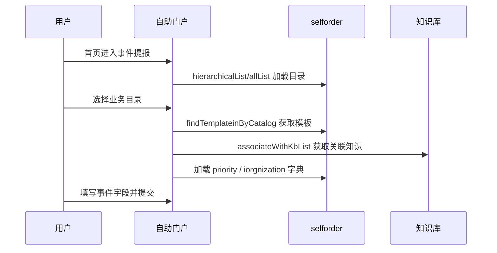

### 5.3 自助提交服务请求并触发审批

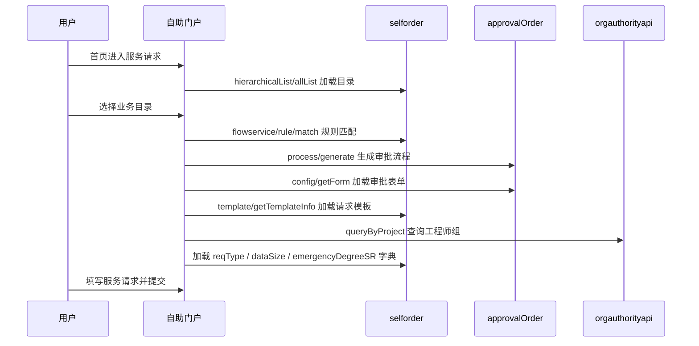

## 6. 已还原菜单/功能清单

| 一级能力 | 二级能力 | 页面路由 | 主要操作 |
| --- | --- | --- | --- |
| 首页 | 搜索/入口/公告/知识 | `#/selfportal/home` | 搜索问题、查看更多、进入各功能 |
| 事件提报 | 目录选择 | `#/selfdeclaration` | 选择服务目录、收藏 |
| 事件提报 | 事件表单 | `#/selfdeclaration` | 填写事件、上传附件、提交 |
| 服务请求 | 目录选择 | `#/servicerequest` | 选择服务目录、收藏 |
| 服务请求 | 请求表单 | `#/servicerequest` | 填写需求、上传附件、提交 |
| 提报进度 | 我的提报/申请 | `#/lenovo/orderprogress` | 查询、重置、查看、自助提报 |
| 审批中心 | 请求审批 | `#/approvalcenter/requestapproval` | 查询、重置、审批、查看 |
| 知识中心 | 知识检索 | `#/knowledgecenter` | 搜索、筛选、收藏/取消收藏 |

## 7. 接口归类

### 7.1 `orgauthorityapi`

| 接口 | 作用 |
| --- | --- |
| `/login/ProjectWorkWechatApp/byDomain` | 域名登录配置 |
| `/login/adfs/saml` | ADFS SAML 登录 |
| `/login/captcha` | 验证码 |
| `/login/project/byDomain` | 域名项目配置 |
| `/paramValue/getParamValueChildrenListByParaCode` | 公共参数字典 |
| `/workOrderGroupEngineer/queryByProject` | 项目工程师/处理组 |

### 7.2 `selfserviceapi/selfportal`

| 接口 | 作用 |
| --- | --- |
| `/api/customer/JJFACPYW` | 客户/用户项目信息 |
| `/config/detail` | 门户配置 |
| `/api/queryPrimaryFiledByProjectCode` | 项目主字段 |
| `/api/serviceCatalog/favoriteList` | 收藏目录 |

### 7.3 `selfserviceapi/selforder`

| 接口 | 作用 |
| --- | --- |
| `/hierarchicalList/allList` | 服务目录树 |
| `/catalogTemplateConfig/count` | 模板数量 |
| `/templateFlowConfig/findTemplateConfiginByCatalog` | 目录模板流程配置 |
| `/templateFlowConfig/findTemplateinByCatalog` | 目录模板 |
| `/templateFlowConfig/findTemplateinInfo` | 模板信息 |
| `/template/getTemplateInfo` | 表单模板详情 |
| `/flowservice/rule/match` | 流程规则匹配 |
| `/paramValue/getParamValueChildrenListByParaCode` | 工单参数字典 |
| `/serviceCatalog/associateWithKbList` | 目录关联知识 |
| `/selfHelpIssueOrder/portalPage` | 门户提报记录 |
| `/messagecenter/notice/getNoticeList` | 公告列表 |
| `/kb/classified` | 知识分类 |
| `/kb/searchArticleContent` | 知识搜索 |

### 7.4 `selfserviceapi/approvalOrder`

| 接口 | 作用 |
| --- | --- |
| `/process/generate` | 生成审批流程 |
| `/config/getForm` | 审批表单配置 |
| `/getValueByCatalog` | 目录审批值 |
| `/queryAssignList` | 待我审批 |
| `/queryHistoryList` | 审批历史 |
| `/queryMyApplyList` | 我发起的审批 |

## 8. 仍缺失或需要二次抓取的信息

本次快照主要还原了前端页面、菜单和接口调用关系，以下信息没有完整证据：

- 事件提报最终提交接口没有捕获到。
- 服务请求最终提交接口没有捕获到，当前只看到规则匹配和审批流生成。
- 审批动作的提交接口没有捕获到，只看到列表查询。
- 工单详情页/审批详情页没有完整页面快照。
- 后端数据库表结构无法从该导出包直接确认，目前的数据对象是基于页面字段和接口命名推断。

建议下一轮补抓：

1. 事件提报点击“提交”后的网络请求。
2. 服务请求点击“提交”后的网络请求。
3. 审批中心点击“审批”并确认后的网络请求。
4. 提报进度点击“查看”后的详情页。
5. 知识中心打开“自助门户操作手册”的详情页。

